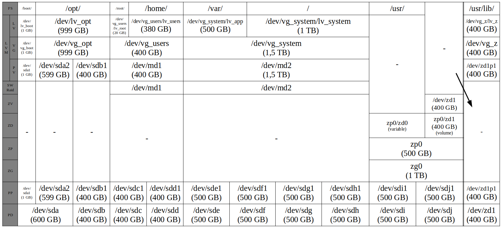
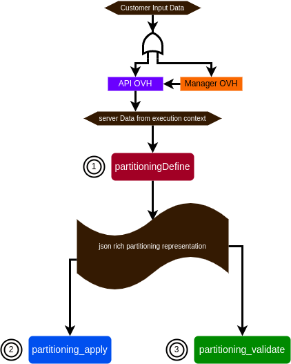

<!-- markdownlint-disable-next-line MD036 -->
**Last updated 8th July 2022**

## Objective

> [!warning]
>
> This article is intended for experimented users that have at least basic Linux knowledge, but more importantly deeper technical knowledge on storage and especially on RAID software as well as Logical volume management (LVM)
>

With [OVHcloud Dedicated Servers](https://www.ovhcloud.com/en-gb/bare-metal/), you can configure Partitions, [software RAID](https://docs.ovh.com/gb/en/dedicated/raid-soft/), LVM, ZFS, etc. during [OS installation](https://docs.ovh.com/gb/en/dedicated/getting-started-dedicated-server/) from the [OVHcloud API](https://api.ovh.com/) as well as the [OVHcloud Manager](https://www.ovh.com/manager/#/dedicated/configuration). In this article, we will focus on the [OVHcloud API](https://api.ovh.com/). This will give more details about the engine that is running in the background in order to create the partitioning on the [dedicated server](https://www.ovhcloud.com/en-gb/bare-metal/) from the input data passed to the [OVHcloud API](https://api.ovh.com/).

Giving deep details about partitioning can be helpful for customer to understand why:

- his custom partitioning could not be applied on his [dedicated server](https://www.ovhcloud.com/en-gb/bare-metal/)
- effective partitioning on the [dedicated server](https://www.ovhcloud.com/en-gb/bare-metal/) is slightly different from the one required by the customer

## Requirements

* a [dedicated server](https://www.ovhcloud.com/en-gb/bare-metal/) **ready to be installed/re-installed**

> [!warning]
>
> A server [OS installation](https://docs.ovh.com/gb/en/dedicated/getting-started-dedicated-server/) will erase all data on your [dedicated server](https://www.ovhcloud.com/en-gb/bare-metal/)
>

## Instructions

### Introduction

During a classical [OS installation](https://docs.ovh.com/gb/en/dedicated/getting-started-dedicated-server/), user is interactively prompted by the OS installer (provided by the software editor) to precise on which disk(s) the Operating System will be installed, how the partitioning layout should be, etc. Once OS installed, it is possible but can be very tricky and risky to change the partitioning layout and especially partitions that are currently used by the system. For that reason, server partitioning is a very important subject that needs to be considered **before** installing an Operating System.

There are a lot of competitors in the baremetal segment of cloud computing, but only a few of them provide the customer with the ability to customize partitioning over their API. Apart from simplicity provided by an API, the main advantage is to be able to fully customize the disks and partitions that will be holding the OS on a server in the cloud.

### Partitioning Overview

When we talk about partitioning layout, we are talking about how your data will be organized on disks, so everything that comes on top of your disk, until the filesystem that is mounted to the OS: from lowest to highest layers:

- disk (physical disk, PD),
- partition (physical partition, PP),
- ZFS: vdev (zgroup, ZG), zpool (ZP), dataset (ZD), ZFS volume (ZV),
- [software RAID](https://docs.ovh.com/gb/en/dedicated/raid-soft/) (SR),
- LVM: physical volume (PV), volume group (VG), logical volume (LV),
- filesystem with a mountpoint (FS)

The following table gives you an overview of the different partitioning components and how these layers are interacting with each other:



### Partitioning API

#### Template Concepts

When triggering an [OS installation](https://docs.ovh.com/gb/en/dedicated/getting-started-dedicated-server/), the customer can either choose between several OVHcloud templates or choose between one of his personal templates (based on an OVHcloud template).

> [!api]
>
> @api {POST} /dedicated/server/{serviceName}/install/start
>

##### OVHcloud templates

An OVHcloud template is an official template that is quasi identical to the official software editor/vendor cloud ready image.

Here is the list (depending on you server compatibility):

> [!api]
>
> @api {GET} /dedicated/installationTemplate
>

The partitioning layout defined within an OVHcloud template cannot be changed: this is called the "default" partitioning scheme layout.

> [!api]
>
> @api {GET} /dedicated/installationTemplate/{templateName}/partitionScheme/{schemeName}/partition
> @api {GET} /dedicated/installationTemplate/{templateName}/partitionScheme/{schemeName}/partition/{mountpoint}
>

##### Customer Templates

User can create a customer installation template based on an OVHcloud template in order to be able to create some custom partitioning layouts:

> [!api]
>
> @api {POST} /me/installationTemplate
>

Once created, it has inherited from the default partitioning layout, and partitions can be listed on the "default" scheme:

> [!api]
>
> @api {GET} /me/installationTemplate/{templateName}/partitionScheme/{schemeName}/partition
>

Of course a partition can be altered, deleted, added and then displayed:

> [!api]
>
> @api {PUT} /me/installationTemplate/{templateName}/partitionScheme/{schemeName}/partition/{mountpoint}
> @api {DELETE} /me/installationTemplate/{templateName}/partitionScheme/{schemeName}/partition/{mountpoint}
> @api {POST} /me/installationTemplate/{templateName}/partitionScheme/{schemeName}/partition
> @api {GET} /me/installationTemplate/{templateName}/partitionScheme/{schemeName}/partition/{mountpoint}
>

#### API Partition Layout structure

A partiton layout is a list of partitions. Here is an example of partition structure:

```json
{
  "raid": "1",
  "filesystem": "ext4",
  "volumeName": "data",
  "size": 0,
  "order": 4,
  "type": "lv",
  "mountpoint": "/var/lib/vz",
}
```

> [!primary]
>
> order: is the partition order within the partition array
>

<!-- markdownlint-disable-next-line MD028 -->
> [!primary]
>
> type: is one of primary, logical, lv
> lv: means that LVM layers will be added on top of the [software RAID](https://docs.ovh.com/gb/en/dedicated/raid-soft/) device (or the physical partition if RAID level is 0)
>
> - primary: only makes sense for MBR partition table (a few old non-uefi servers are still doing that)
> - logical: if you don't know what to choose
>

<!-- markdownlint-disable-next-line MD028 -->
> [!primary]
>
> volumeName: only useful if type lv is set
>

### Partitioning Backend

#### Architecture

So as you can guess, there is already an abstraction layer between the partitioning description on the [OVHcloud API](https://api.ovh.com/) (that is quite minimalist) and the real partitioning (that can be very complex).

The key feature of this partitioning is the separation between the processing and the action script. The processing is also reused by an additional component : the validation script in order to check that the partitioning is correct (especially to check that size is what customer has required).

Those 3 components are described as 3 different steps within the [OS installation](https://docs.ovh.com/gb/en/dedicated/getting-started-dedicated-server/) process :



In a nutshell, you now have 3 steps related to disk partitioning:

- partitioningDefine: This script runs on the OVH infra. It just converts the data from the [OVHcloud API](https://api.ovh.com/) to a richer json representation.

> [!primary]
>
> During the [OS installation](https://docs.ovh.com/gb/en/dedicated/getting-started-dedicated-server/) on the manager, it is described as `Processing Partitioning`{.action} in the progress bar.
>

- partitioning_apply: This script runs on the customer server, takes the json rich partitioning representation data and apply partitioning scheme to the target server

> [!primary]
>
> During the [OS installation](https://docs.ovh.com/gb/en/dedicated/getting-started-dedicated-server/) on the manager, it is described as `Applying Partitioning`{.action} in the progress bar.
>

- partitioning_validate: This script runs on the customer server, takes the json rich partitioning representation data and compares it with target server disk partitioning configuration

> [!primary]
>
> During the [OS installation](https://docs.ovh.com/gb/en/dedicated/getting-started-dedicated-server/) on the manager, it is described as `Checking Partitioning`{.action} in the progress bar.
>

#### Error handling

Basic customer input data errors are directly handled by the [OVHcloud API](https://api.ovh.com/). This is the most common and this is an easier situation because customer can see the error synchronously and retry with the correct data format directly.

Customer input data related to partitioning might be too specific to be checked by the the [OVHcloud API](https://api.ovh.com/) and therefore requiring a pre-processing. In that case it is handled by the partitioningDefine step. Drawback is that customer is notified later during the [OS installation](https://docs.ovh.com/gb/en/dedicated/getting-started-dedicated-server/) process.

> [!primary]
>Within the manager OVH this is visible through the progress bar
>From the [OVHcloud API](https://api.ovh.com/), you can get this status with the following API call:
> [!api]
>
> @api {GET} /dedicated/server/{serviceName}/install/status
>

There are 2 types of errors:

- **ovh errors**: customer is not responsible for the error, customer can re-install with another partitioning layout but OVHcloud will have to fix the bug anyway
- **customer errors**: customer has required a partitioning layout that is not possible to achieve or because the server will not boot

> [!primary]
>
> partitioning_apply and partitioning_validate only contain ovh errors types.
>

In the next section we will only focus on the **customer errors** types within the **partitioningDefine step**, because this is only helpful for the customer.

##### common customer errors

The following table gives an overview of well known customer errors and how to fix them.

|Error message|Details|Solution(s)|
|---|---|---|
|Some Linux distributions such as RHEL family OSes don't support those mountpoints / mountpoint reserved/managed by OVH (\*\*\*). Please remove those mountpoints and restart an installation|- You have chosen `/boot/efi` as mountpoint. OVH will create this partition automatically for you if your server needs one<br />- You have chosen a mountpoint that is symlinked on some operating systems. See [Filesystem Hierarchy Standard](https://refspecs.linuxfoundation.org/fhs.shtml) for more details.|- Choose another mountpoint for the partition or remove this partition for your partitioning layout|
|Partition of type \*\*\* with mountpoint \*\*\* cannot fill the disk.|- You have chosen the `swap` partition to fill the disk|- `swap` partition has to be fixed to a specific size so that customer knows what he is really doing depending on the target OS `swap` max capacity|
|Missing `/` partition. Please add a `/` partition in your partition scheme!|- Any Linux based OS needs at least a `/` partition|- Add a `/` partition in your partitioning layout|
|\*\*\*. Please adjust partitions so that the \*\*\* partition fits on \*\*\* disk(s)|- You have chosen a partition with a RAID that requires a number of disks that your server can provide, but some disks are already full because of other partitions and/or your this current partition|- if not already set to another partition: set the partition size to fill the disk<br />- Reduce this partition size so that it fits the disk(s)<br />- Adjust (reduce) other partitions so that it fits the disk(s)|

#### Input customer auto-fixing

In order to improve customer experience, reduce [OVH support](https://help.ovhcloud.com/en-gb/) workload and/or keeping logic from legacy installer not to introduce breaking change for customer, some customer inputs are automatically fixed/changed by the backend. The following table gives an overview of what is currently auto fixed/changed by the partitioningDefine script:

|Subject|Description|
|---|---|
|LV Grouping|All partitions of type `lv` with same RAID level will be grouped within the same VG (if possible by the disk(s) space capacity)|
|VG expanding|In case of LV partition with a RAID level greater than 0, the VG will be expanded across several PPs (therefore PDs) and no SR device will be created|
|VG Disk fill|Remaining disk(s) space will be filled by a VG (if any LV(s) exist(s)). LV(s)'s size(s) that is/are part of this VG will remain, not 100% of that VG will be used so that customer can easily adjusts LV(s) or add LV(s) afterward|
|Raid level reducing|In case customer has chosen a partition with a RAID level that requires more disk(s) than the server has, RAID level will be automatically reduced in the following order: 6, 10, 5, 1, 0 (or 7 (raidz3), 6 (raidz2), 5 (raidz), 1 (mirror), 0 (striped VDev) for ZFS)|
|PP size reducing|In case customer has chosen a PP that requires more space than the server has, this PP will fill be reduced so that it fits the disk(s). Note that in case several PPs require more space than the system has, the script will only act on the first partition, raising an error later in the script for the second too big partition. Also note that an error will be raised if the customer has set another partition to fill the disk via the [OVHcloud API](https://api.ovh.com/)|

## Go further <a name="gofurther"></a>

[Configuring software RAID](https://docs.ovh.com/gb/en/dedicated/raid-soft/)

[Managing Hardware RAID](https://docs.ovh.com/gb/en/dedicated/raid-hard/)

Join our community of users on <https://community.ovh.com/en/>.
